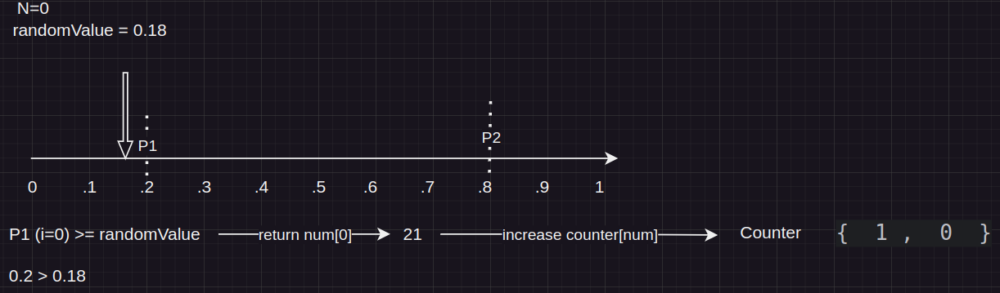
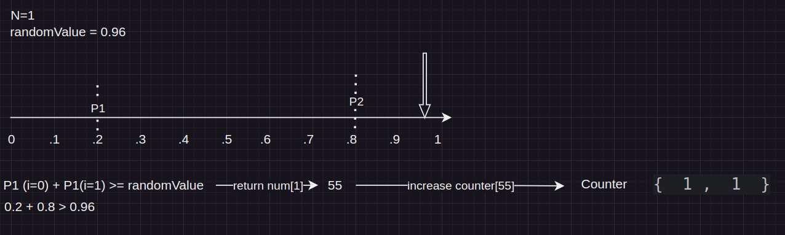
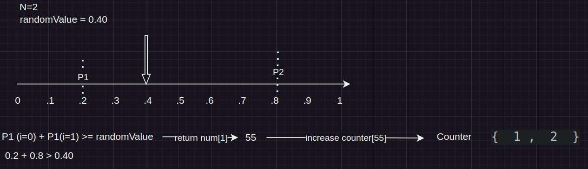
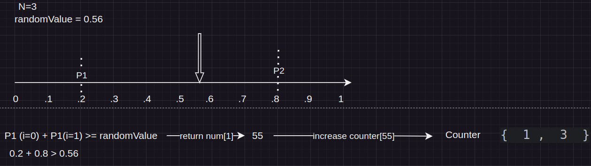
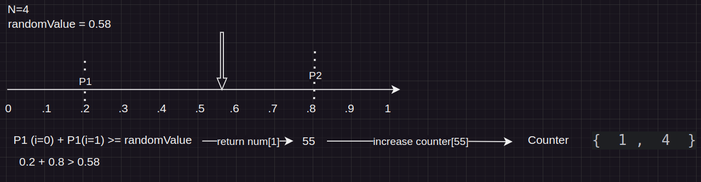

# Task
Create a random generator class which takes as input a seed of numbers and their
associated probabilities. Implement the method nextNum() and a minimal but effective set of
unit tests. The method nextNum() should only ever return one of the seeded numbers and
given enough calls the probability of the output should converge on the seed probability.
Implement the solution in the language of your choice, Java is preferred, but Kotlin and other
languages are completely fine. Make sure your code is exemplary, as if it was going to be
shipped as part of a production system. You should leverage comments whenever you see fit
to.

## Constraints

- numbers[] is non-null
- probabilities[] is non-null
- Σ[probabilities[]] == 1

## Java
JDK 17

## Maven
mvn 3.6.X+

### Dependencies
junit5

## Algorithm and Psuedo code
- The method will loop through each probability comparing with randomValue.
- Accumulating probabilities until it's higher than randomValue, if total probability is higher than randomValue than return the number.
- When the number is returned we'd store it into a counter array (of same size) to keep track how many times number is returned. 

Example representation, 
Let's say we have following,

Numbers         [  21, 55 ]

Probabilities   [ 0.2, 0.5]

N = 5, that means we'd call nextNum 5 times. 
Initialise counter [ 0, 0 ] to store number of times 21 or 55 is returned.

N=0


N=1


N=2


N=3


N=4


In the end we have `counter` with [1, 4] -> associating with positions of number [21, 55] Psudo code will return
```shell
21: 1 times
55: 4 times
```


## Time complexity
O(N) as there's 1 loop for N iterations.

## space complexity
O(1) as there's no data structure. 

## Unit tests
[RandomGenTest](/src/test/java/org/example/RandomGenTest.java)
- Unit tests runs higher number of iterations as floating point arithmetic can create rounding difference than can lead to intermittent test case failures.
- i.e the less number of iterations -> the higher the chances of broken test case. Therefore, 
- Unit tests performs 1000 iterations and generates an array of actual probabilities by performing division  `counter[i] / numIterations`
- Unit tests to expect an exceptions to respect the constraints. 